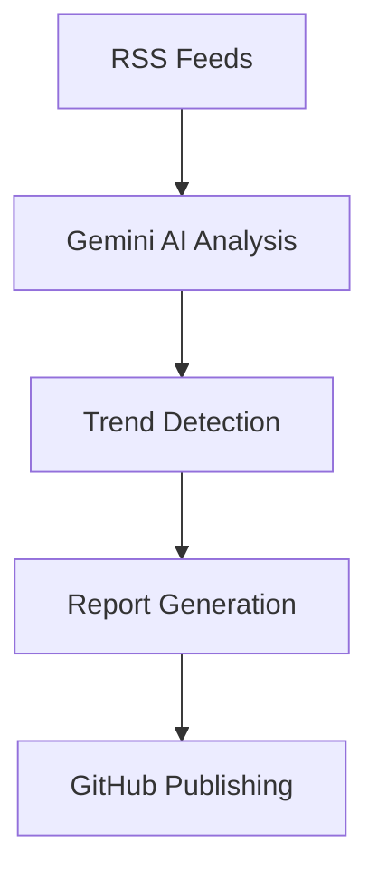

# 🧠 NeuralPulse

### Autonomous AI Intelligence Platform

NeuralPulse is an AI-powered intelligence platform that automatically tracks, analyzes, and publishes the latest developments in Artificial Intelligence.

## 🚀 Features

* Aggregates AI news from TechCrunch and Google AI Blog
* Uses Gemini AI for intelligent analysis and summarization
* Identifies emerging technology trends
* Recommends skills students should learn
* Generates AI project ideas based on current trends
* Automatically publishes daily intelligence reports to GitHub

## 🛠️ Tech Stack

* n8n
* Gemini AI
* RSS Feeds
* GitHub API
* Markdown

## ⚡ Workflow

RSS Feeds → AI Analysis → Trend Detection → Report Generation → GitHub Publishing



## 🎯 Why I Built This

As a B.Tech Computer Science student, I wanted an automated system that could filter information overload, track emerging AI trends, and generate actionable insights for students and developers without manually reading dozens of articles every day.

## 📊 Sample Insights

* Trending AI technologies
* Industry developments
* Student learning recommendations
* Project ideas for developers
* Daily AI intelligence reports

## 📁 Reports

NeuralPulse automatically generates and publishes daily intelligence reports containing:

* Top Technology Trends
* Industry Impact Analysis
* Skills Students Should Learn
* Beginner-Friendly Project Ideas
* Emerging Technologies
* Technologies Becoming Less Relevant

Reports are stored in the `reports/` directory.

## 🚀 Future Roadmap

* Multi-source AI news aggregation
* Startup and funding analysis
* AI research paper tracking
* Personalized intelligence reports
* Email and Telegram delivery

## 📂 Project Structure

```text
neural-pulse/
├── docs/
│   └── workflow.png
├── workflow/
│   └── neural-pulse-workflow.json
├── reports/
└── README.md
```

---

Built with AI, Automation, and Curiosity 🚀
